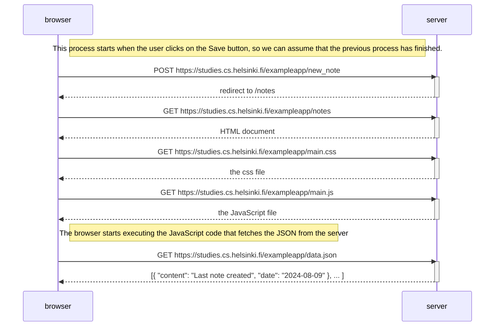

# Part0 Exercice 4

```mermaid
sequenceDiagram
    participant browser
    participant server

    Note right of browser: This process starts when the user clicks on the Save button, so we can assume that the previous process has finished.

    browser->>server: POST  https://studies.cs.helsinki.fi/exampleapp/new_note
    activate server
    server-->>browser: redirect to /notes
    deactivate server

    browser->>server: GET https://studies.cs.helsinki.fi/exampleapp/notes
    activate server
    server-->>browser: HTML document
    deactivate server

    browser->>server: GET https://studies.cs.helsinki.fi/exampleapp/main.css
    activate server
    server-->>browser: the css file
    deactivate server

    browser->>server: GET https://studies.cs.helsinki.fi/exampleapp/main.js
    activate server
    server-->>browser: the JavaScript file
    deactivate server

    Note right of browser: The browser starts executing the JavaScript code that fetches the JSON from the server

    browser->>server: GET https://studies.cs.helsinki.fi/exampleapp/data.json
    activate server
    server-->>browser: [{ "content": "Last note created", "date": "2024-08-09" }, ... ]
    deactivate server
```