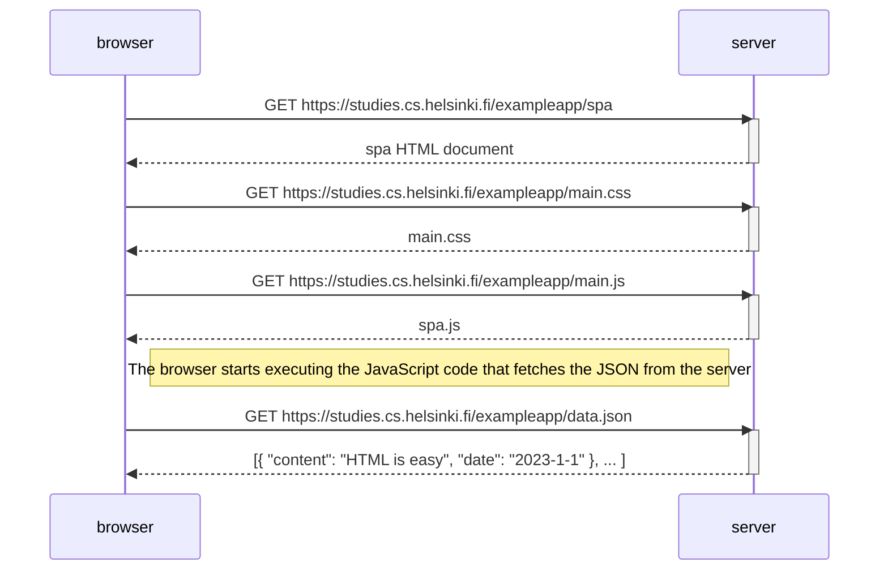

# Part0 Exercice 5

The procedure at the beginning of the application is the same as in the previous case. The server sends firs the HTML; it requests the CSS and the JavaScript. When that last document is getting evaluated, it calls for the JSON where all the data is stored. The main difference between the single-page application and the multiple-page application comes after the user sends the form into the server.

