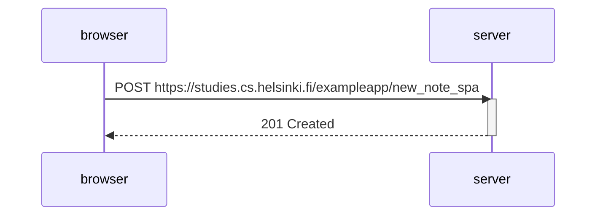

# Part0 Exercice 6

 We can notice that here there is no redirection by the server after it gets the POST method. It returns a 201 signal instead, which notifies the browser that the information has reached the server properly.

